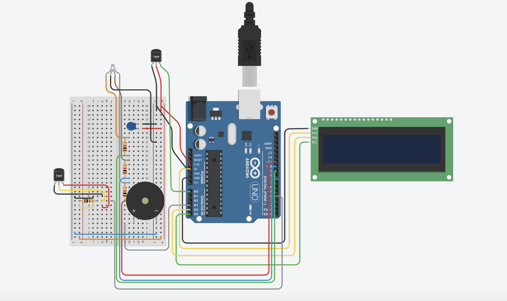

# Biometric Health Monitor
Replace this text with a brief description (2-3 sentences) of your project. This description should draw the reader in and make them interested in what you've built. You can include what the biggest challenges, takeaways, and triumphs from completing the project were. As you complete your portfolio, remember your audience is less familiar than you are with all that your project entails!

You should comment out all portions of your portfolio that you have not completed yet, as well as any instructions:
```HTML 
<!--- This is an HTML comment in Markdown -->
<!--- Anything between these symbols will not render on the published site -->
```

| **Engineer** | **School** | **Area of Interest** | **Grade** |
|:--:|:--:|:--:|:--:|
| Mikaela Li | Saint Francis High School | Biomedical Engineering | Incoming Senior

**Replace the BlueStamp logo below with an image of yourself and your completed project. Follow the guide [here](https://tomcam.github.io/least-github-pages/adding-images-github-pages-site.html) if you need help.**


  
# Final Milestone

**Don't forget to replace the text below with the embedding for your milestone video. Go to Youtube, click Share -> Embed, and copy and paste the code to replace what's below.**

<iframe width="560" height="315" src="https://www.youtube.com/watch?v=wPDK3R-Wfns" title="YouTube video player" frameborder="0" allow="accelerometer; autoplay; clipboard-write; encrypted-media; gyroscope; picture-in-picture; web-share" allowfullscreen></iframe>

For your final milestone, explain the outcome of your project. Key details to include are:
- What you've accomplished since your previous milestone
- What your biggest challenges and triumphs were at BSE
- A summary of key topics you learned about
- What you hope to learn in the future after everything you've learned at BSE


# Second Milestone

**Don't forget to replace the text below with the embedding for your milestone video. Go to Youtube, click Share -> Embed, and copy and paste the code to replace what's below.**

<iframe width="560" height="315" src="https://www.youtube.com/embed/y3VAmNlER5Y" title="YouTube video player" frameborder="0" allow="accelerometer; autoplay; clipboard-write; encrypted-media; gyroscope; picture-in-picture; web-share" allowfullscreen></iframe>

For your second milestone, explain what you've worked on since your previous milestone. You can highlight:
- Technical details of what you've accomplished and how they contribute to the final goal
- What has been surprising about the project so far
- Previous challenges you faced that you overcame
- What needs to be completed before your final milestone 

# First Milestone

**Don't forget to replace the text below with the embedding for your milestone video. Go to Youtube, click Share -> Embed, and copy and paste the code to replace what's below.**

<iframe width="560" height="315" src="https://www.youtube.com/watch?v=LMOpLYTjThU" title="YouTube video player" frameborder="0" allow="accelerometer; autoplay; clipboard-write; encrypted-media; gyroscope; picture-in-picture; web-share" allowfullscreen></iframe>

For your first milestone, describe what your project is and how you plan to build it. You can include:
- An explanation about the different components of your project and how they will all integrate together
- Technical progress you've made so far
- Challenges you're facing and solving in your future milestones
- What your plan is to complete your project

My project is a biometric health monitor measuring heartrate. It is coded through an arduino and displayed on an LCD. First, I wired the sensor to the arduino. I connected power wire the 3V3 pin on arduino which supplies power to the sensor and helps it turn on. I connected ground wire to GND pin on arduino which completes the circuit and brings electricity back to the arduino after going to the sensor. I connected signal wire to A0 pin on arduino, which sends the signal level or heart rate data from the sensor to the arduino. Then I wired LCD display to arduino. I connected power wire to 5V pin on arduino, which powers the LCD and allows it to turn on. I connected ground wire to GND pin on arduino, which brings electricity back to arduino after going to the LCD. I connected SDA (data line) to A4 pin on arduino, which sends text data to the LCD. I connected SCL(clock line) to A5 pin on arduino, which synchronized timing for the data. I connected arduino to computer then I used an adaptor and connected the arduino to computer after downloading arduino IDE. I added code to arduino IDE. I first downloaded required libraries allowing pre-coded functions to work: one for the pulse sensor and one for the LCDdded constants. Next, I defined the fixed values that the arduino can go back and look at. I added set-up for the sensor and LCD and a loop function to help the monitor run forever. In the loop, there is mechanism to store and check for heartbeats. Finally, I add print code to print heart rate on LCD.


# Starter Project

**Don't forget to replace the text below with the embedding for your milestone video. Go to Youtube, click Share -> Embed, and copy and paste the code to replace what's below.**

<iframe width="560" height="315" src="https://www.youtube.com/watch?v=TlzVSYYXwzc" title="YouTube video player" frameborder="0" allow="accelerometer; autoplay; clipboard-write; encrypted-media; gyroscope; picture-in-picture; web-share" allowfullscreen></iframe>

For your second milestone, explain what you've worked on since your previous milestone. You can highlight:
- Technical details of what you've accomplished and how they contribute to the final goal
- What has been surprising about the project so far
- Previous challenges you faced that you overcame
- What needs to be completed before your final milestone 

# Schematics 
Here's where you'll put images of your schematics. [Tinkercad](https://www.tinkercad.com/blog/official-guide-to-tinkercad-circuits) and [Fritzing](https://fritzing.org/learning/) are both great resoruces to create professional schematic diagrams, though BSE recommends Tinkercad becuase it can be done easily and for free in the browser. 


*Model uses temperature sensor in place of heartrate sensor. Both 3 pronged sensor, so the wiring is the same.

# Code
Here's where you'll put your code. The syntax below places it into a block of code. Follow the guide [here]([url](https://www.markdownguide.org/extended-syntax/)) to learn how to customize it to your project needs. 

```C++
// Include necessary libraries
#define USE_ARDUINO_INTERRUPTS true
#include <PulseSensorPlayground.h>
#include <LiquidCrystal_I2C.h>
#include <DallasTemperature.h>
#include <OneWire.h>

LiquidCrystal_I2C lcd(0x27, 16, 2);  // set the LCD address to 0x27 for a 16 chars and 2 line display

//variables
long previousMillis = 0;
long blinkHeart = 0;
long currentMillis = 0;
long buzzerMillis = 0;

// Constants
const int PULSE_SENSOR_PIN = 0;  // Analog PIN where the PulseSensor is connected
const int LED_PIN = 13;          // On-board LED PIN
const int THRESHOLD = 550;       // Threshold for detecting a heartbeat
const int INTERVAL = 1000;

// Create PulseSensorPlayground object
PulseSensorPlayground pulseSensor;

OneWire oneWire(4);
DallasTemperature sensors(&oneWire);

void setup() {
  // Initialize Serial Monitor
  Serial.begin(9600);
  lcd.init();
  lcd.backlight();

  // Configure PulseSensor
  pulseSensor.analogInput(PULSE_SENSOR_PIN);
  pulseSensor.blinkOnPulse(LED_PIN);
  pulseSensor.setThreshold(THRESHOLD);
  //setup pin 8 for LED
  pinMode(8, OUTPUT);
  digitalWrite(8, LOW);
  // Check if PulseSensor is initialized
  if (pulseSensor.begin()) {
    Serial.println("PulseSensor object created successfully!");
  }
  //rgb light

  pinMode(9, OUTPUT);
  pinMode(10, OUTPUT);
  pinMode(11, OUTPUT);

  sensors.begin();

  pinMode(A3, OUTPUT);

  digitalWrite(A3, LOW);
}

void loop() {


  lcd.setCursor(0, 0);
  lcd.print("Heart Rate");

  digitalWrite(8, LOW);

  // Get the current Beats Per Minute (BPM)
  int currentBPM = pulseSensor.getBeatsPerMinute();

  // Check if a heartbeat is detected
  if (pulseSensor.sawStartOfBeat()) {
    blinkHeart = 0;
    Serial.println("♥ A HeartBeat Happened!");
    Serial.print("BPM: ");
    Serial.println(currentBPM);

    lcd.clear();
    lcd.setCursor(0, 1);
    lcd.print("BPM: ");
    lcd.print(currentBPM);
    lcd.print("  ");
    lcd.print(sensors.getTempCByIndex(0));
    lcd.print("C");
  }
  if ((millis() - blinkHeart) > 200) {
    lcd.setCursor(0, 0);
    lcd.print("Heart Rate");
  }
  //if (currentBPM < 40 || currentBPM > 100) {
  //digitalWrite(8, HIGH);
  //}
  // Add a small delay to reduce CPU usage
  // delay(200);
                  
  //rgb light
  if (currentBPM <= 50) {
    analogWrite(9, 0);
    analogWrite(10, 0);
    analogWrite(11, 255);
    //delay(1000); // Wait for 1000 millisecond(s)
  }
  if (currentBPM > 50 && currentBPM < 100) {
    analogWrite(9, 0);
    analogWrite(10, 255);
    analogWrite(11, 0);
    //delay(1000); // Wait for 1000 millisecond(s)
  }
  if (currentBPM >= 100) {
    analogWrite(9, 255);
    analogWrite(10, 0);
    analogWrite(11, 0);
    //delay(1000); // Wait for 1000 millisecond(s)
  }

  currentMillis = millis();
  if (currentMillis - previousMillis >= INTERVAL) {
    sensors.requestTemperatures();
    Serial.println("Celsius temperature: ");
    Serial.println(sensors.getTempCByIndex(0));
    previousMillis = currentMillis;
    //delay(1000);
  }

  //currentBPM > 49 && currentBPM < 51;

  if (currentBPM < 50 || currentBPM > 100) {
    if ((millis() - buzzerMillis) < 700) { 
      Serial.println("sdfg");
      analogWrite(A3, 130); }
    //analogWrite(A3, 130);
    else if ((millis() - buzzerMillis) < 1400) {
      Serial.println("hi");
      analogWrite(A3, 0);
    } 
    else {
      buzzerMillis = millis();
    }
    currentBPM = pulseSensor.getBeatsPerMinute();
    //  lcd.clear();
  }

  if (currentBPM >= 50 && currentBPM <= 100) {
    analogWrite(A3, 0);
  }

  //if (currentBPM < 100) {
  // analogWrite(A3, 150);
  //}

  //currentBPM > 99 && currentBPM < 101;

  // 1 < currentBPM && 1 < 1;
  delay(10);
}
```

# Bill of Materials
Here's where you'll list the parts in your project. To add more rows, just copy and paste the example rows below.
Don't forget to place the link of where to buy each component inside the quotation marks in the corresponding row after href =. Follow the guide [here]([url](https://www.markdownguide.org/extended-syntax/)) to learn how to customize this to your project needs. 

| **Part** | **Note** | **Price** | **Link** |
|:--:|:--:|:--:|:--:|
| Item Name | What the item is used for | $Price | <a href="https://www.amazon.com/Arduino-A000066-ARDUINO-UNO-R3/dp/B008GRTSV6/"> Link </a> |
| Item Name | What the item is used for | $Price | <a href="https://www.amazon.com/Arduino-A000066-ARDUINO-UNO-R3/dp/B008GRTSV6/"> Link </a> |
| Item Name | What the item is used for | $Price | <a href="https://www.amazon.com/Arduino-A000066-ARDUINO-UNO-R3/dp/B008GRTSV6/"> Link </a> |

# Other Resources/Examples
One of the best parts about Github is that you can view how other people set up their own work. Here are some past BSE portfolios that are awesome examples. You can view how they set up their portfolio, and you can view their index.md files to understand how they implemented different portfolio components.
- [Example 1](https://trashytuber.github.io/YimingJiaBlueStamp/)
- [Example 2](https://sviatil0.github.io/Sviatoslav_BSE/)
- [Example 3](https://arneshkumar.github.io/arneshbluestamp/)

To watch the BSE tutorial on how to create a portfolio, click here.
